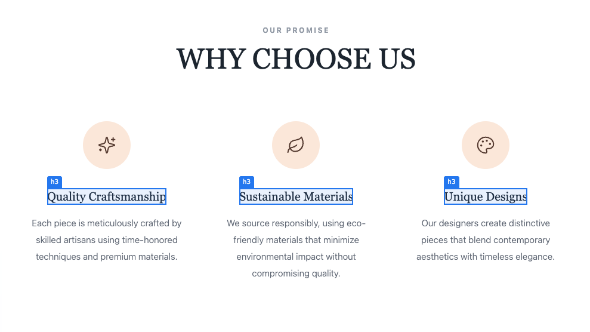
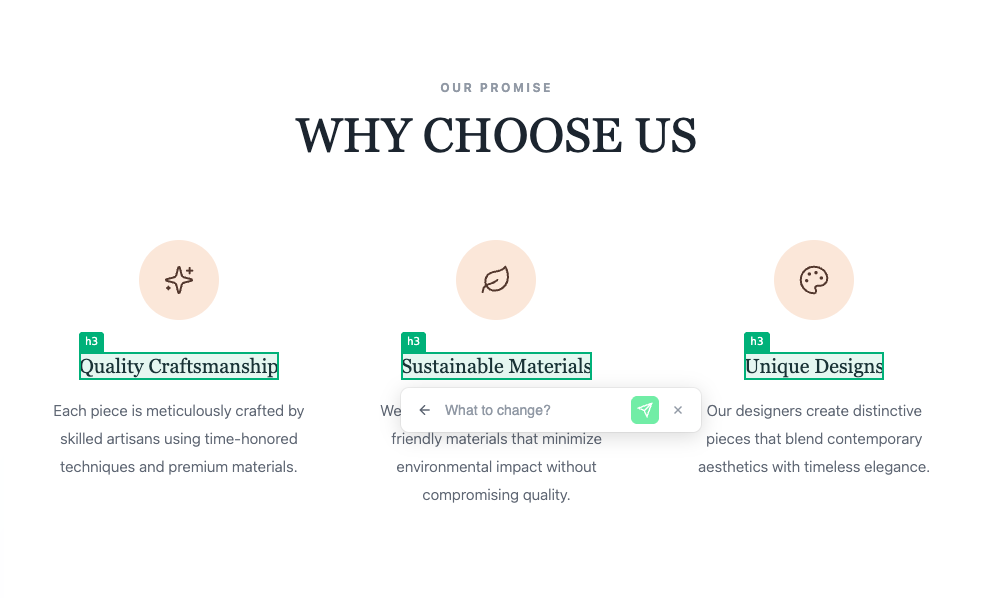

# vite-plugin-visual-edit

A Vite plugin for visual editing of React components. Highlights elements, shows source locations, and enables in-browser content editing with iframe communication support.


<p align="center">
  
</p>

<p align="center">
  
</p>


## Features

- 🎯 **Visual Highlighting** - Hover over elements to see blue highlights with tag name labels
- ✏️ **Click to Edit** - Click any element to open an inline edit form
- 📍 **Source Location Tracking** - Automatically adds `data-source-location` attributes to all JSX elements
- 🔄 **Dynamic Content Detection** - Detects elements with dynamic content via `data-dynamic-content` attribute
- 📨 **iframe Communication** - Perfect for embedding in visual editors with postMessage support
- ⚡ **Development Only** - Zero overhead in production builds
- 🎨 **Fully Configurable** - Toggle on/off, keyboard shortcuts, badges, and more

## Installation

```bash
npm install vite-plugin-visual-edit -D
# or
yarn add vite-plugin-visual-edit -D
# or
pnpm add vite-plugin-visual-edit -D
```

## Quick Start

```typescript
// vite.config.ts
import { defineConfig } from "vite";
import visualEdit from "vite-plugin-visual-edit";

export default defineConfig({
  plugins: [...visualEdit()],
});
```

That's it! The plugin works alongside `@vitejs/plugin-react` to add visual editing capabilities.

## Configuration

```typescript
import { defineConfig } from "vite";
import visualEdit from "vite-plugin-visual-edit";

export default defineConfig({
  plugins: [
    ...visualEdit({
      // Babel exclude patterns - files matching won't get source attributes
      exclude: [/node_modules/, /components\/ui\//],

      // Save toggle state to localStorage (default: true)
      persistState: true,

      // Auto-hide loading after N seconds (default: 10)
      submitTimeout: 10,

      // Show toggle badge at bottom-right corner (default: false)
      showBadge: false,

      // Enable Ctrl+Shift+E keyboard shortcut (default: false)
      enableKeyboardShortcut: false,

      // postMessage type for edit requests (default: 'visual-edit-request')
      messageTypeDataRequest: "visual-edit-request",

      // postMessage type for responses (default: 'visual-edit-response')
      messageTypeDataResponse: "visual-edit-response",

      // postMessage type for toggle commands (default: 'visual-edit-toggle')
      messageTypeToggle: "visual-edit-toggle",

      // Start with editing enabled (default: false)
      defaultEnabled: false,

      // Customizable colors
      colorHover: "#3b82f6", // Hover highlight border color (blue-500)
      colorSelected: "#10b981", // Selected element border color (green-500)
      colorSubmit: "#10b981", // Submit button color (green-500)

      // Customizable attribute names (defaults shown)
      attributeSourceLocation: "data-source-location",
      attributeDynamicContent: "data-dynamic-content",

      // Multi-language support
      language: "en", // 'en' | 'ko' | 'vn' | 'jp' | 'ch'

      // Custom translations or overrides
      translations: {
        vn: {
          placeholder: "Bạn muốn sửa gì thế?",
        },
      },
    }),
  ],
});
```

## Multi-language Support

The plugin comes with built-in translations for:

- English (`en`) - Default
- Korean (`ko`)
- Vietnamese (`vn`)
- Japanese (`jp`)
- Chinese (`ch`)

You can set the initial language via the `language` option or change it dynamically.

## How It Works

### Source Location Attributes

The plugin's Babel transformer adds two attributes to every JSX element:

```html
<div data-source-location="components/Header:15:4" data-dynamic-content="false">
  Hello World
</div>
```

- `data-source-location` (configurable via `attributeSourceLocation`) - Format: `path/to/file:line:column`
- `data-dynamic-content` (configurable via `attributeDynamicContent`) - `"true"` if element contains dynamic expressions

### Toggle On/Off

The visual editor starts **disabled by default**. Toggle it using:

#### 1. postMessage (for iframe embedding)

```javascript
// Enable
iframe.contentWindow.postMessage(
  { type: "visual-edit-toggle", enabled: true },
  "*"
);

// Disable
iframe.contentWindow.postMessage(
  { type: "visual-edit-toggle", enabled: false },
  "*"
);

// Toggle
iframe.contentWindow.postMessage({ type: "visual-edit-toggle" }, "*");

// Change Language
iframe.contentWindow.postMessage(
  {
    type: "visual-edit-language",
    language: "vn", // 'en', 'ko', 'vn', 'jp', 'ch'
  },
  "*"
);
```

#### 2. JavaScript API

```javascript
window.__VISUAL_EDIT__.enable();
window.__VISUAL_EDIT__.disable();
window.__VISUAL_EDIT__.toggle();
window.__VISUAL_EDIT__.setLanguage("vn");
window.__VISUAL_EDIT__.isEnabled(); // returns boolean
```

#### 3. Keyboard Shortcut (if enabled)

- **Windows/Linux**: `Ctrl + Shift + E`
- **Mac**: `Cmd + Shift + E`

### Handling Edit Requests

When a user submits an edit, a postMessage is sent to the parent window:

```javascript
// Listen for edit requests in parent window
window.addEventListener("message", (event) => {
  if (event.data.type === "visual-edit-request") {
    const { sourceLocation, content, element } = event.data.data;

    console.log("Edit request:", {
      sourceLocation, // "components/Header:15:4"
      content, // User's input text
      element, // "div", "button", etc.
    });

    // Process the edit...

    // Send response to close the form
    event.source.postMessage(
      {
        type: "visual-edit-response",
        success: true,
      },
      "*"
    );

    // Or send error (keeps form open)
    event.source.postMessage(
      {
        type: "visual-edit-response",
        success: false,
        error: "Failed to save",
      },
      "*"
    );
  }
});
```

### Request/Response Types

```typescript
// Request sent from iframe
interface VisualEditRequestMessage {
  type: string; // 'visual-edit-request'
  data: {
    sourceLocation: string; // "path/to/file:line:column"
    content: string; // User's input
    element: string | null; // Tag name
  };
}

// Response sent to iframe
interface VisualEditResponseMessage {
  type: string; // 'visual-edit-response'
  success: boolean;
  error?: string;
}

// Toggle command
interface VisualEditToggleMessage {
  type: string; // 'visual-edit-toggle'
  enabled?: boolean; // undefined = toggle
}

// Language command
interface VisualEditLanguageMessage {
  type: string; // 'visual-edit-language'
  language: "en" | "ko" | "vn" | "jp" | "ch";
}
```

## Global API

The plugin exposes a global API on `window.__VISUAL_EDIT__`:

```typescript
interface VisualEditAPI {
  enable(): void;
  disable(): void;
  toggle(): void;
  setLanguage(lang: string): void;
  isEnabled(): boolean;
  config: VisualEditConfig;
}
```

## Browser Support

- Chrome 80+
- Firefox 75+
- Safari 14+
- Edge 80+

## TypeScript

Full TypeScript support with exported types:

```typescript
import type {
  VisualEditOptions,
  VisualEditConfig,
  VisualEditRequestData,
  VisualEditRequestMessage,
  VisualEditResponseMessage,
  VisualEditToggleMessage,
  VisualEditAPI,
} from "vite-plugin-visual-edit";
```

## License

MIT

## Contributing

Contributions are welcome! Please open an issue or submit a pull request.
